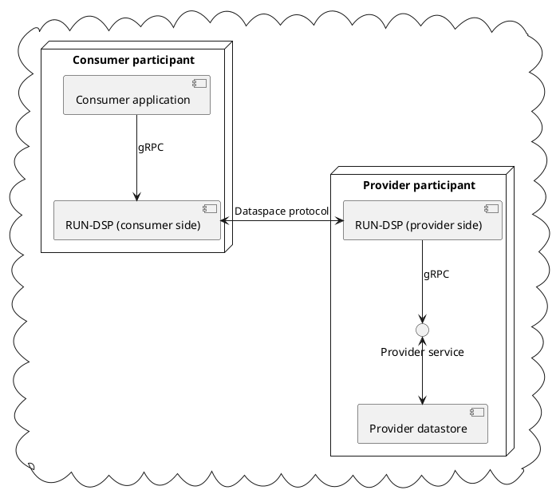

<p align="center">
    
</p>

<p align="center">
    
    
    
    
</p>

# RUN-DSP

> [!IMPORTANT]
> RUN-DSP and the gRPC bindings are considered in "pre-alpha", this means that things can change
> heavily in between versions. We will document these changes in the release notes.

RUN-DSP is a lightweight, high-performant, and easy to manage connector for the
[IDSA Dataspace protocol](https://docs.internationaldataspaces.org/ids-knowledgebase/dataspace-protocol)
implemented in the [Go programming language](https://go.dev/). What distinguishes RUN-DSP from other
dataspace connectors is that RUN-DSP tried to stay simple to maintain, manage, while  allow
non-dataspace aware applications to interface with a dataspace by means of [gRPC](https://grpc.io/).


## Overview



RUN-DSP listens on a port for dataspace requests, and queries a provider backend for the relevant
information via gRPC calls. This information can be catalog listings, information about
a single dataset, and information on how to download the dataset. In dataspace parlance, this would
mean RUN-DSP fulfils the provider role.

RUN-DSP can also listen on a port for gRPC control commands, that another application can use
to request dataspace operations to be execute by gRPC. The consumer role in dataspace terms.
This functionality still requires that the dataspace port is reachable publicly.

As per the dataspace specification, it is possible for RUN-DSP to fulfil the consumer, and provider
side from a single instalation if properly configured.

## Getting started

### Development

To start developing on RUN-DSP itself, you can set up a basic setup like this:

First start up the "dataspace" with `docker-compose`:

```sh
$ docker-compose up
```

Then start RUN-DSP connecting to the reference provider:

```sh
$ go run ./cmd/ -c ./conf/localdev.toml sever
```

You can now start hacking and testing RUN-DSP.

### Integration

#### Offering data to a dataspace

To start integrating your own application, and/or data into a dataspace using RUN-DSP, you will have
to offer a [RUN-DSP provider service](https://github.com/go-dataspace/run-dsrpc). This can either be
integrated into your already existing software, or you can build a translation service that
translates the gRPC calls into calls that your application already accepts.

Once your provider service supports all the endpoints, all you need to do is set the right
configuration, all provider configuration settings are documented in the `[server.provider]` section
of the [reference configuration file](./conf/reference.toml).

We offer a [reference provider](https://github.com/go-dataspace/reference-provider) that can be used
as an example of how to implement the provider service.


#### Interacting with dataspace participants.

RUN-DSP offers gRPC calls to allow an application to easily interact with other dataspace
participants. The [RUN-DSP client](./docs/usage/client.md) uses these to implement a basic dataspace
client. The control service can be configured using the `[server.control]` section of the
configuration file.

## Contributing

We welcome code contributions, but as RUN-DSP is being rapidly developed, it might be wise to
open an issue first to discuss any proposed issues.

<!--
Sections to add once we have policies for it:

- Security
- Code guidelines
- Community
- Flesh out contributing more.
-->
